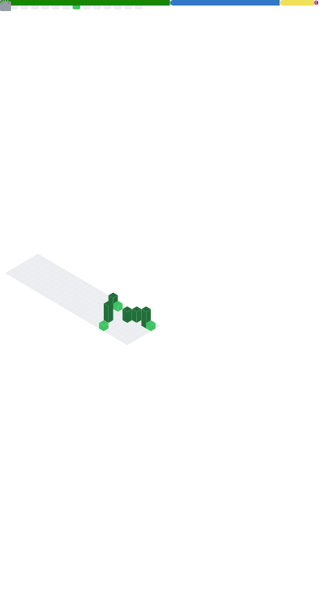

<!-- Hero -->

  

<!-- Links -->

  
  
  

---

## 👨‍💻 About
Full‑stack engineer focused on **clean architecture**, **performance**, and **great DX**.  
I ship with **.NET**, **React/Next.js**, **NestJS/Node.js**, and relational databases.

- 🎯 Currently: polishing **Next.js + NestJS** templates and **.NET** APIs
- 🧩 Interests: domain modeling, API design, CI‑ready monorepos
- 🤝 Open to: collabs on **.NET + React/Next** or **NestJS** backends

---

## 🔧 Tech
**Languages:** C#, JavaScript, TypeScript, SQL  
**Frontend:** React, Next.js (App Router)  
**Backend:** .NET, Node.js, NestJS  
**Data:** PostgreSQL, SQL Server, MySQL, Supabase  
**Ops/Dev:** GitHub Actions, REST, linting/formatting, testing

  
  
  
  
  
  
  
  
  

---

## 🚀 Highlights
- ⚙️ **API first**: OpenAPI‑driven contracts, validation, and logging
- 🧱 **Clean layering**: domain, app, infra separation
- 🧪 **Quality**: unit/integration tests, CI checks, pre‑commit hooks
- 📦 **DX**: scripts, templates, and consistent tooling

---

<!-- Optionally replace the two cards above with your auto-generated metrics.svg (includes private commits):

  

-->

---

## 🤝 Let’s Collaborate
If you’re building with **.NET**, **React/Next.js**, or **NestJS**, say hi!  
> _“Simplicity is the soul of efficiency.”_
